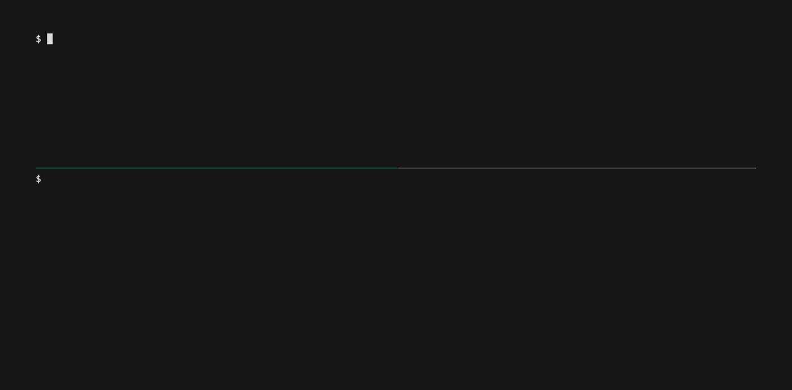
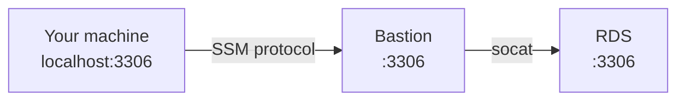

# Conduit

[](https://github.com/nicola-strappazzon/conduit/actions/workflows/test.yml)
[](https://github.com/nicola-strappazzon/conduit/releases)

[Requirements](#requirements) · [Installation](#installation) · [Usage](#usage)

Conduit is a CLI for AWS SSM port forwarding. It opens the SSO login page when needed and reconnects when a session ends.



## Advantages

- Reach private services with one command.
- No public SSH port or SSH keys.
- Handle AWS SSO in your browser.
- Reconnect automatically.

## How it works

Conduit sends traffic through an SSM-managed bastion to a private service:



The bastion needs SSM, access to the RDS instance, `socat`, and `sudo`.

Conduit starts or reuses `socat` before it opens the tunnel. The same `--remote-port` is used on the bastion and the service.

When Conduit exits normally, or after `Ctrl+C`, it stops the `socat` listener for that port.

It runs this command on the bastion:

```bash
sudo nohup socat TCP-LISTEN:3306,fork,reuseaddr TCP:example.cxvub4jf47su.eu-central-1.rds.amazonaws.com:3306 </dev/null >/tmp/socat-3306.log 2>&1 &
```

## Requirements

- An AWS profile allowed to start SSM sessions.
- The [Session Manager plugin](https://docs.aws.amazon.com/systems-manager/latest/userguide/session-manager-working-with-install-plugin.html) in your `PATH`.
- An SSM-managed bastion that can reach the service.
- `socat` and `sudo` on the bastion.
- Go, using the version in `go.mod`, when building from source.

## Installation

### macOS

Install with Homebrew:

```bash
brew install nicola-strappazzon/tap/conduit
xattr -d com.apple.quarantine /opt/homebrew/bin/conduit
```

Run the second command only if macOS blocks the app.

### From source

Build from source:

```bash
task build
```

Move `conduit` to a directory in your `PATH` to run it from anywhere.

## Usage

Run without flags to see all options:

```bash
conduit
```

Conduit starts `socat` and then opens the tunnel:

```bash
conduit \
  --profile my-profile \
  --target i-bastion \
  --remote-port 3306 \
  --local-port 3306 \
  --host database.internal
```

Use `--reconnect=false` to stop when the session ends.

Press `Ctrl+C` to close the local tunnel. AWS keeps the session record until its timeout.
